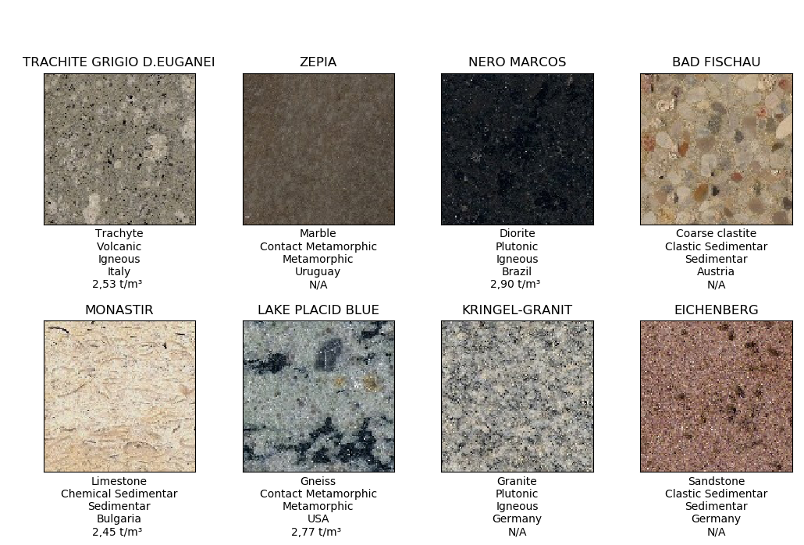
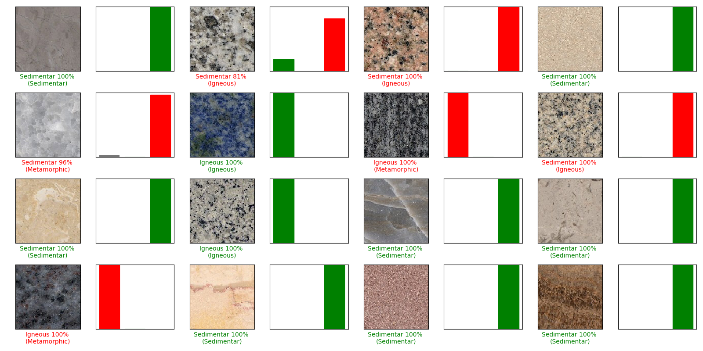
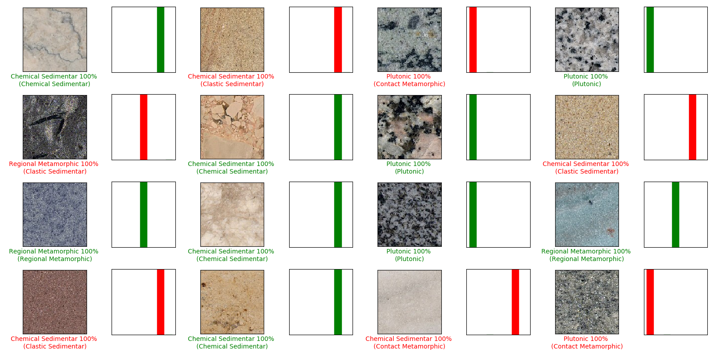
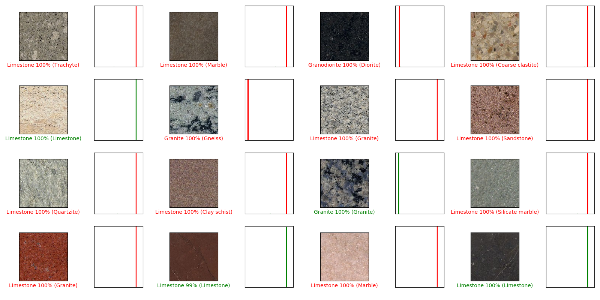

# Stone Recogognition

David Morim

José Henrique Brito

## Description

This repository contains:
- a dataset with images and metadata of natural stones
- a prototype application to recognize natural stone from images

## Dataset

The dataset contains 6556 stones and is derived from the www.naturalstone-online.com database.

Each stone has groundtruth metadata and image URL. 

The stone classification groundtruth was hand-corrected by an expert geologist.

## App

